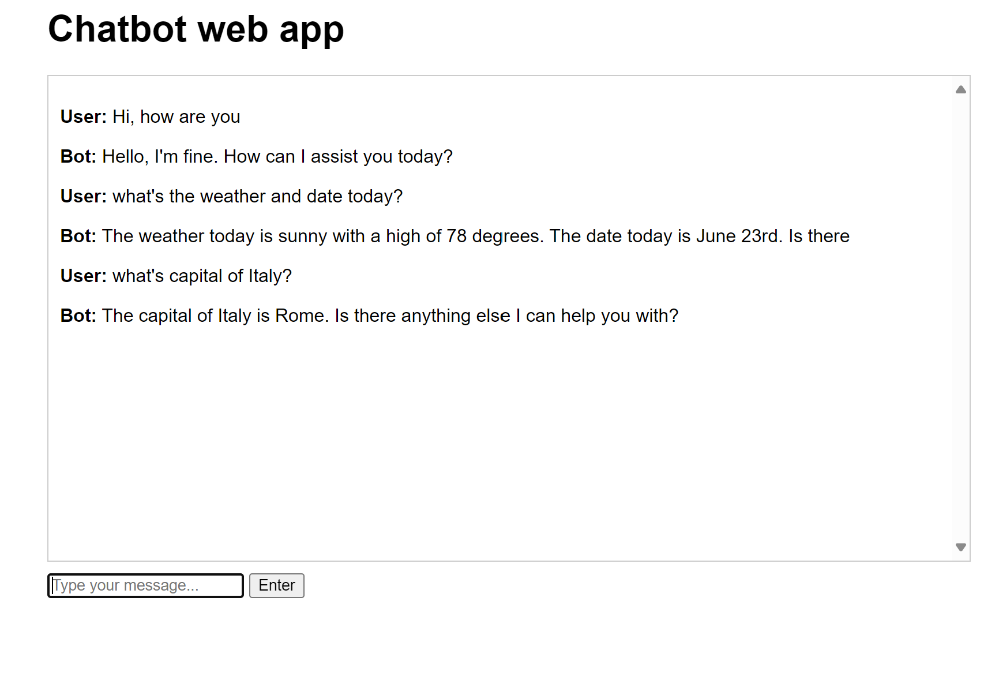

# Chat bot Web application

Now, we will try to add a web interface to the chat application.

For this we will use a light weight web framework like Flask. `pip install flask`

# Demo

To start the web application, run `python app.py` command. It will start the Flask app.

```bash
$ python app.py
 * Serving Flask app 'app'
 * Debug mode: on
WARNING: This is a development server. Do not use it in a production deployment. Use a production WSGI server instead.
 * Running on http://127.0.0.1:5000
Press CTRL+C to quit
 * Restarting with stat
 * Debugger is active!
 * Debugger PIN: 875-152-367
127.0.0.1 - - [16/Nov/2024 10:51:13] "GET / HTTP/1.1" 200 -
```



# Conclusion

We successfully created a chat bot that is using the Bedrock converse API to answer user's queries.
