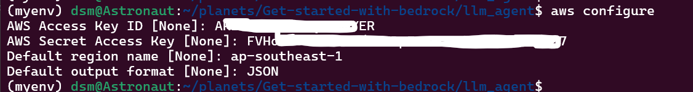
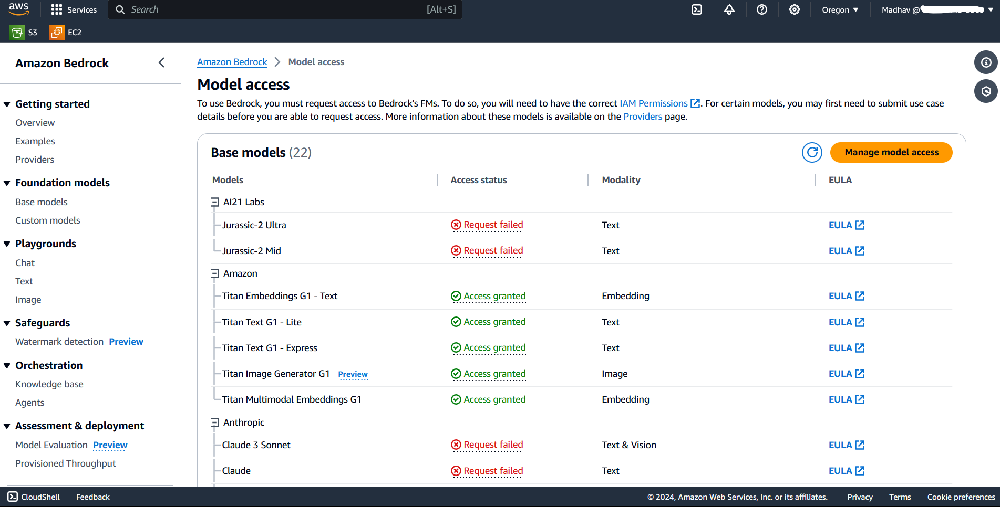

# How to Start

## Set Credentials

First, to access Bedrock you need to give required permission to the IAM Role. You can do this via IAM Console, add AmazonBedrockFullAccess permission to your IAM user.

**Configure the aws credentials:**

Add your IAM role access ID and secret access key, these you can find from IAM console. 

Enter default region, choose the region where Bedrock is available. and finally add default output format like Json, text.

You can use `aws configure list` command to check your configured values.

## Get Access of Foundation Models

One thing to note is that bedrock foundation models are not available in all regions. You can check what foundation models are available by changing your region.

As you can see in the above image, I am in the Oregon (us-west-2) region. In this region, I can access all models or atleast can request for access.

To access any of these models first make sure, a valid payment method is set in your aws account, preferably a credit card.

To access:
1. Go to bedrock -> Model access.
2. Request access for any model. 

It will take around 5 minutes, before access is granted. Either the access will be granted or you will receive an error.

# Troubleshooting

### Malformed input request:
raise ValueError(f"Error raised by bedrock service: {e}")
ValueError: Error raised by bedrock service: An error occurred (ValidationException) when calling the InvokeModelWithResponseStream operation: Malformed input request: string [Observation] does not match pattern ^(\|+|User:)$, please reformat your input and try again.

Status: **Unable to resolve this**

### Connection Timeout Issue

Error: 
botocore.exceptions.EndpointConnectionError: Could not connect to the endpoint URL: "https://bedrock-runtime.us-west-2.amazonaws.com/model/amazon.titan-text-lite-v1/invoke

This issue can be resolved by resolving the "could not resolve Host" issue.

###  Could not resolve Host

Error: fatal: unable to access 'https://github.com/DS-Meena/Get-started-with-bedrock.git/': Could not resolve host: github.com

`ping google.com` result is *ping: google.com: Temporary failure in name resolution*. Means internet issue.

1.  `vi /etc/resolv.conf`
2. Add following line in that file: nameserver 8.8.8.8

This will resolve both your ping and github issue.

## Windows
Following issues are related to windows system, only.

### Issue with pydantic 2.5.3 [Not Resolved]

error: 
pydantic.errors.PydanticUserError: If you use `@root_validator` with pre=False (the default) you MUST specify `skip_on_failure=True`. Note that `@root_validator` is deprecated and should be replaced with `@model_validator`.

python - 3.7.6

pydantic - 2.5.3

langchain - 0.0.27

**Possible Solution**
Go to this file D:\MARS Program Files\miniconda\lib\site-packages\pydantic\deprecated\class_validators.py", line 240 and change default value of skip_on_failure to True. 

def root_validator(
    *__args,
    pre: bool = False,
    skip_on_failure: bool = True,
    allow_reuse: bool = False,
) -> Any:

[Reference](https://docs.pydantic.dev/2.5/errors/usage_errors/#root-validator-pre-skip)

After resolving this error, I am getting following error

File "D:\MARS Program Files\miniconda\lib\site-packages\pydantic\_internal\_model_construction.py", line 376, in inspect_namespace
    code='model-field-missing-annotation',
pydantic.errors.PydanticUserError: A non-annotated attribute was detected: `lookup_index = 0`. All model fields require a type annotation; if `lookup_index` is not meant to be a field, you may be able to resolve this error by annotating it as a `ClassVar` or updating `model_config['ignored_types']`.

Could not find a way to resolve the above error. So, decided to ditch hub only and downgrade pydantic.

### Issue with pydantic 1.10

pip install "pydantic==1.*"

cannot import name 'hub' from 'langchain'

*ImportError: cannot import name 'hub' from 'langchain'*
To resolve this error use latest version of langchain and pydantic.

**Solution**

`pip install --upgrade langchain pydantic`

